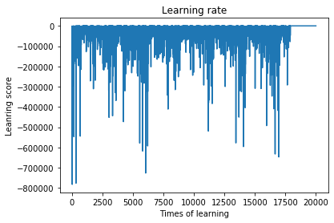

# Project 

Project: 
 
 - Option Implied Tree (replicate derman work)
 
 - Calibration and SABR parameter, solving the global minimal through stochastic optimization and weighted wings control
 
 - Simulation of option delta hedging.

# Reinforcement Learning

Agent to perform hedging and replicate various payoff

Folder included:
1. Forward_Hedging 

Simple train to the agent which to learn a short position hegding activities.
We punish the agent for any hedging error as our aim is to mitigate risk, refer to line 56 and line 73.
We reward the agent when it has sqaured its position.

This is a simple lerning where the agent has a short position at the begining and train over the same timeframe. However, this work has provide the core idea of reinforcement learning. The agent play with the rules set and explores the new thing and update the its 'brain', ie the q-table.

Other than that, we also include serveral random element or restriction in the environment to let the agent sort out best solution

2. Option dynamic hedging and cost analysis(in progress)

Simple option writer position mangement.

The agent has given a short call option and learn to hedge the option risk with buy or sell different unit physical stock.

It is restricted to hold zero or 1 unit of stock all the time.

The leanring rate is as well perform as the previous work.

Idea: to implement convulutional neural network, graphical learn the movement relationship between the option and stock price.

3. Pu_tCall_RL 

Allow agent to do combination of vanilla call and put to test put call parity.

Agent can only enter into two option to replicate a long or short position. Long two call, long one call short one call and so ons. 

Agent is given option quoted with range of strike in the market quote (with same tenor).

q_table seperate into two, replicate either a long position or a short position.

Conclusion: Agent can replicate a long or short position exactly as Put-call parity stated.

